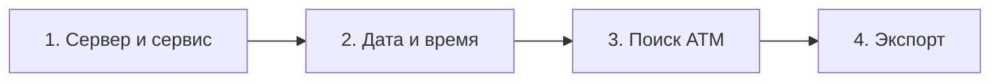
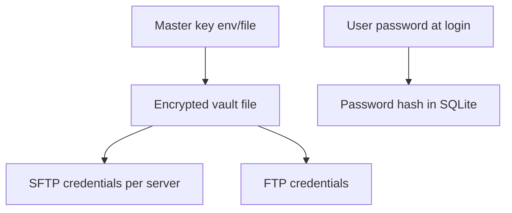
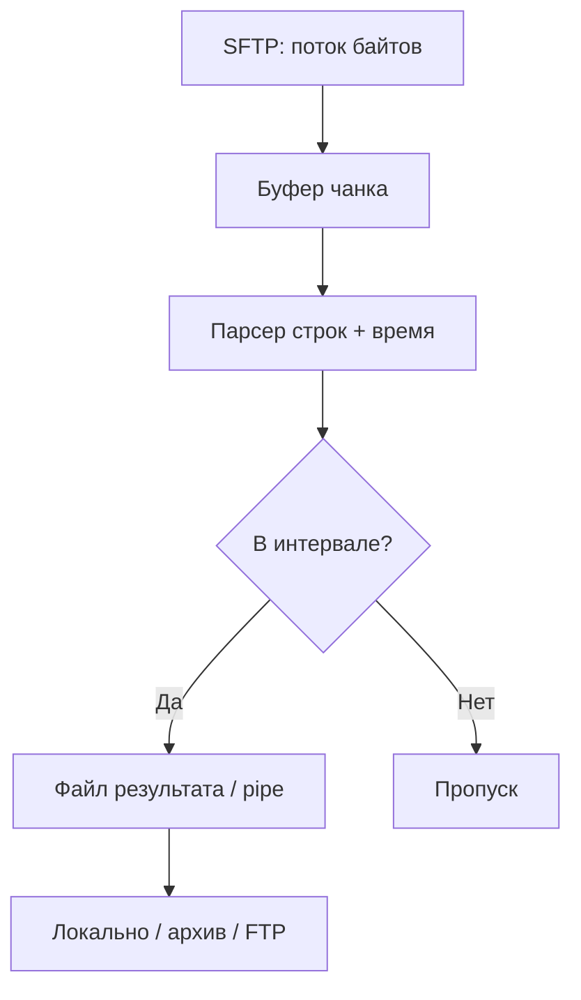
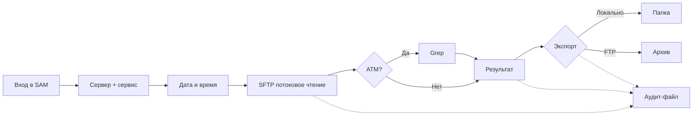

# System Admin Management (SAM)

Приложение на **Python** для централизованного управления микросервисами на нескольких серверах. Операторы работают через **простой веб-интерфейс**: подключение к хостам по **SFTP**, отбор логов по времени и по номеру АТМ, экспорт локально или на **FTP**. У каждого пользователя — **своя учётная запись**; все действия пишутся в **журнал аудита**; пароли и секреты хранятся в **зашифрованном хранилище**.

---

## Назначение

| Задача | Описание |
|--------|----------|
| Инфраструктура | **5 серверов**, на каждом — **несколько микросервисов** |
| Доступ | Удалённые логи через **SFTP** (потоковое чтение, без загрузки гигабайт в RAM) |
| Пользователи | **Несколько учётных записей** с ролями (оператор / администратор) |
| Первый этап | Выгрузка логов за **конкретный интервал** (дата + часы/минуты) |
| Поиск | Фильтр по **номеру АТМ** и другим значениям (grep) |
| Экспорт | Локальная папка или **архив + FTP** в выбранную из списка папку |
| Безопасность | **Шифрование** секретов, **полный аудит** действий в файл |
| UX | **Удобный, простой** интерфейс — минимум шагов, понятные подписи |

---

## Целевая модель данных

```
Пользователь SAM (логин, роль)
 └── Журнал аудита (все действия → файл)

Сервер (1..5)
 └── Микросервис (N)
      └── Лог-файлы (1–4+ ГБ)
           └── Строки с меткой времени (разные разделители)
```

Конфигурация: серверы, сервисы, пути логов, шаблоны времени, FTP-пресеты. Пароли SFTP/FTP и хэши пользователей SAM — только в **зашифрованном хранилище**, не в git.

---

## Интерфейс (как будет выглядеть)

Основной вариант — **веб-приложение** в браузере (одна установка на сервере приложения, пользователи заходят по HTTPS). Принципы дизайна: светлая нейтральная тема, крупные кнопки, пошаговый мастер без перегруза полями.

### Экран входа

```
┌─────────────────────────────────────────────────────────────┐
│                    System Admin Management                   │
│                                                              │
│              Логин:    [________________________]            │
│              Пароль:   [________________________]            │
│                                                              │
│                      [ Войти ]                               │
│                                                              │
│         © Внутренний инструмент · все действия логируются    │
└─────────────────────────────────────────────────────────────┘
```

После входа отображается имя пользователя и кнопка «Выйти». Неудачные попытки входа тоже попадают в аудит.

### Главный экран (после входа)

```
┌──────────┬──────────────────────────────────────────────────┐
│  SAM     │  Добро пожаловать, ivanov          [ Выйти ]     │
├──────────┼──────────────────────────────────────────────────┤
│ ▶ Логи   │  Быстрый старт                                    │
│   Серверы│  ┌────────────────────────────────────────────┐  │
│   История│  │ 1. Сервер      [ srv-03 ▼ ]                 │  │
│   Экспорт│  │ 2. Сервис      [ payment-api ▼ ]            │  │
│          │  │ 3. Дата        [ 21.05.2026 ]  📅           │  │
│  (админ) │  │ 4. Время с     [ 14:30 ]  по [ 15:45 ]      │  │
│  Польз.  │  │ 5. АТМ (опц.)  [ 12345678    ]  ☐ включить   │  │
│  Аудит   │  └────────────────────────────────────────────┘  │
│          │                                                   │
│          │  [ Найти логи ]     [ Очистить форму ]           │
│          │                                                   │
│          │  Последние задачи                                 │
│          │  ┌────────────────────────────────────────────┐  │
│          │  │ 21.05 14:32  srv-03 / payment  → 12 450 строк│  │
│          │  │ 21.05 11:10  srv-01 / atm-gw   →  ошибка SFTP│  │
│          │  └────────────────────────────────────────────┘  │
└──────────┴──────────────────────────────────────────────────┘
```

Левая панель — только нужные разделы. Основная область — **одна форма** для типового сценария, без лишних вкладок.

### Экран результата и экспорта

После поиска показывается сводка и превью (первые N строк), не весь многогигабайтный файл:

```
┌─────────────────────────────────────────────────────────────┐
│  Результат: 12 450 строк · ~18 МБ (отфильтровано)           │
│  Источник: app.log (3.8 ГБ на сервере, обработано потоком)  │
│  Время обработки: 2 мин 14 сек                               │
├─────────────────────────────────────────────────────────────┤
│  [■■■■■■■■■■□□□□□□□□□□] 62%  чтение srv-03…                 │
│  (для файлов >1 ГБ — прогресс, кнопка «Отмена»)             │
├─────────────────────────────────────────────────────────────┤
│  Превью (100 строк):                                         │
│  2026-05-21 14:31:02 ... ATM=12345678 ...                   │
│  ...                                                         │
├─────────────────────────────────────────────────────────────┤
│  Экспорт:                                                    │
│  ○ Сохранить в мою папку   [ ~/sam-exports/2026-05-21/ ]    │
│  ○ Архив + FTP             [ logs-archive-main ▼ ]          │
│                            Папка: [ /incoming/logs/atm ▼ ]  │
│                                                              │
│              [ Скачать ]  [ Отправить на FTP ]               │
└─────────────────────────────────────────────────────────────┘
```

### Экран администратора (роль admin)

- список пользователей: создать / заблокировать / сбросить пароль;
- просмотр **журнала аудита** (фильтр по пользователю, дате, действию);
- настройка серверов и FTP-папок (без отображения паролей в открытом виде).

### Навигация по шагам (мастер)

Для новых пользователей тот же сценарий можно показать как мастер из 4 шагов:



На каждом шаге — одна «карточка», кнопки «Назад» / «Далее», внизу подсказка что будет на следующем шаге.

---

## Пользователи и учётные записи

| Элемент | Описание |
|---------|----------|
| Учётная запись | Уникальный **логин**, пароль при входе, отображаемое имя |
| Роли | **operator** — работа с логами и экспорт; **admin** — пользователи, аудит, конфиг |
| Сессия | Вход по логину/паролю, сессия с таймаутом неактивности |
| Пароль SAM | Хранится только как **хэш** (Argon2/bcrypt), не в открытом виде |
| Персональные пути | У оператора может быть своя подпапка для локального экспорта |

Первый администратор создаётся при установке (или через CLI `sam users create-admin`).

---

## Журнал аудита (полное логирование действий)

**Каждое** значимое действие пользователя записывается в **отдельный append-only файл** (ротация по размеру/дате). Формат — структурированные строки (JSON Lines), удобно для grep и SIEM.

### Что логируется

| Категория | Примеры событий |
|-----------|-----------------|
| Аутентификация | вход, выход, неудачный вход, истечение сессии |
| Логи | выбор сервера/сервиса, интервал времени, запуск поиска, отмена, ошибка SFTP |
| Поиск | номер АТМ, количество найденных строк |
| Экспорт | сохранение локально, создание архива, отправка на FTP, путь назначения |
| Админ | создание/блокировка пользователя, смена роли, изменение конфига |
| Система | старт/останов приложения, ошибки шифрования хранилища |

### Пример записи

```json
{"ts":"2026-05-21T14:32:01+03:00","user":"ivanov","action":"log.search","server":"srv-03","service":"payment-api","date":"2026-05-21","from":"14:30","to":"15:45","atm":"12345678","lines":12450,"duration_sec":134,"status":"ok"}
```

Файлы аудита: например `data/audit/audit-2026-05-21.jsonl`. Доступ на чтение — только **admin**. Запись в аудит **не отключается** для обычных пользователей.

---

## Защищённое хранилище паролей и секретов

Все чувствительные данные — в **encrypted vault**, не в plain-text конфигах.

| Что хранится | Как |
|--------------|-----|
| Пароли пользователей SAM | Хэш Argon2id / bcrypt в БД |
| Пароли SFTP/FTP, ключи SSH | **Шифрование** в vault (AES-GCM через `cryptography`) |
| Ключ шифрования vault | Файл `master.key` или переменная `SAM_MASTER_KEY` **вне git**, права `0600` |

Схема:



При отображении в UI пароли и ключи **никогда** не показываются целиком — только «••••••••» и кнопка «Заменить».

---

## Функциональные требования

### 1. Выборка логов по времени (MVP)

- дата: год, месяц, день;
- время: часы и минуты (начало и конец интервала);
- подключение SFTP, поиск файлов за дату;
- парсинг меток времени (разные разделители — regex/шаблоны в конфиге сервиса);
- возврат только строк в интервале.

Примеры форматов в логах: `2026-05-21 14:30:00`, `21.05.2026 14:30:00`, `2026/05/21T14:30:00`.

### 2. Поиск по АТМ

- опциональное поле номера банкомата;
- grep по отфильтрованному потоку (без полной загрузки исходного файла в память).

### 3. Экспорт

| Действие | Поведение |
|----------|-----------|
| **Локально** | В персональную или общую папку: `сервер/сервис/дата/` |
| **Архив + FTP** | zip/tar.gz → загрузка в выбранную из списка FTP-папку |

### 4. Большие лог-файлы (1–4+ ГБ)

Критичное требование: исходные логи часто **>1 ГБ**, иногда **~4 ГБ**.

| Правило | Реализация |
|---------|------------|
| Не грузить файл целиком в RAM | Потоковое чтение по SFTP чанками (например 1–8 МБ) |
| Фильтр на лету | Построчный или блочный разбор; отбрасывать строки вне интервала сразу |
| Диск вместо памяти | Временные файлы в `data/tmp/`, удаление после задачи |
| Прогресс | Процент прочитанных байт, ETA, кнопка **Отмена** |
| Ускорение (опционально) | Удалённый `grep` по SSH, если на сервере разрешено — меньше трафика |
| Превью в UI | Только первые N строк результата, не весь вывод |
| Лимиты | Настраиваемый макс. размер результата экспорта; предупреждение до старта |



---

## Сценарий работы (общий)



---

## Архитектура (черновик)

| Модуль | Ответственность |
|--------|-----------------|
| `web` / `ui` | Страницы: вход, поиск логов, экспорт, админка |
| `auth` | Сессии, роли, проверка пароля |
| `users` | CRUD пользователей, хэши паролей |
| `audit` | Запись всех действий в JSONL-файл |
| `vault` | Шифрование/дешифрование секретов SFTP/FTP |
| `config` | Серверы, сервисы, regex времени, FTP-пресеты |
| `sftp_client` | SFTP, потоковое чтение больших файлов |
| `log_parser` | Парсинг времени, фильтр интервала |
| `grep_filter` | Поиск по АТМ |
| `export` | Локально, архив, FTP |
| `jobs` | Фоновые задачи, прогресс, отмена |

Интерфейс — **веб (основной)**; CLI — вспомогательный (установка, `create-admin`, диагностика).

---

## Конфигурация (пример)

```yaml
app:
  host: 0.0.0.0
  port: 8080
  session_timeout_min: 60
  audit_dir: data/audit
  vault_path: data/vault.enc
  tmp_dir: data/tmp
  max_preview_lines: 100

servers:
  - id: srv-01
    host: 10.0.0.1
    port: 22
    services:
      - name: payment-api
        log_dir: /var/log/payment-api
        time_patterns:
          - '%Y-%m-%d %H:%M:%S'
          - '%d.%m.%Y %H:%M:%S'

ftp_targets:
  - id: logs-archive-main
    host: ftp.example.com
    remote_dirs:
      - /incoming/logs/atm
      - /incoming/logs/payment
```

Секреты серверов — в **vault**; `SAM_MASTER_KEY` — в окружении на хосте приложения.

---

## Этапы разработки

1. **Основа**: vault, пользователи, аудит, простой веб-вход.
2. **MVP логов**: SFTP потоково + фильтр по времени + прогресс для >1 ГБ.
3. **Поиск АТМ** и превью результата.
4. **Экспорт**: локально + архив + FTP.
5. **Админ-UI**: пользователи, просмотр аудита, настройка серверов.
6. **Оптимизация**: параллель на нескольких серверах, удалённый grep, кэш списка файлов.

---

## Стек: возможные библиотеки

### SSH / SFTP

| Библиотека | Назначение | Примечание |
|------------|------------|------------|
| **[Paramiko](https://www.paramiko.org/)** | SFTP, потоковое чтение | **Рекомендуется** |
| [asyncssh](https://asyncssh.readthedocs.io/) | Асинхронный SFTP | Параллельная выгрузка с 5 серверов |
| [Fabric](https://www.fabfile.org/) | SSH + удалённый grep | Опционально для 4 ГБ файлов |

### FTP

| Библиотека | Назначение | Примечание |
|------------|------------|------------|
| **`ftplib`** (stdlib) | FTP | **Рекомендуется** |
| [ftputil](https://ftputil.sschwarzer.net/) | Удобные пути | Альтернатива |

### Веб-интерфейс (основной UI)

| Библиотека | Назначение | Примечание |
|------------|------------|------------|
| **[FastAPI](https://fastapi.tiangolo.com/)** | API + WebSocket прогресса | **Рекомендуется** |
| [Jinja2](https://jinja.palletsprojects.com/) | HTML-шаблоны | Простые формы без тяжёлого SPA |
| [HTMX](https://htmx.org/) | Обновление прогресса без сложного JS | Удобно для прогресс-бара |
| [NiceGUI](https://nicegui.io/) | Быстрый UI на Python | Альтернатива «всё на Python» |
| [Streamlit](https://streamlit.io/) | Прототип | Быстро, но меньше контроля над UX |

### Пользователи, сессии, пароли SAM

| Библиотека | Назначение | Примечание |
|------------|------------|------------|
| **[passlib](https://passlib.readthedocs.io/)** + **[argon2-cffi](https://argon2-cffi.readthedocs.io/)** | Хэш паролей | **Рекомендуется** |
| [bcrypt](https://github.com/pyca/bcrypt/) | Хэш паролей | Альтернатива Argon2 |
| [itsdangerous](https://itsdangerous.palletsprojects.com/) | Подпись сессий/cookies | С FastAPI |
| [python-jose](https://python-jose.readthedocs.io/) | JWT | Если API без cookies |

### Шифрование хранилища секретов

| Библиотека | Назначение | Примечание |
|------------|------------|------------|
| **[cryptography](https://cryptography.io/)** | AES-GCM, Fernet, PBKDF2 | **Рекомендуется** для vault |
| [PyNaCl](https://pynacl.readthedocs.io/) | Secretbox | Альтернатива |
| [keyring](https://github.com/jaraco/keyring) | Master key в ОС | На рабочей станции админа |

### База пользователей и аудит

| Библиотека | Назначение | Примечание |
|------------|------------|------------|
| **[SQLite](https://www.sqlite.org/)** + **[SQLAlchemy](https://www.sqlalchemy.org/)** | Пользователи, роли | **Рекомендуется** |
| [aiosqlite](https://github.com/omnilib/aiosqlite) | Async SQLite | С FastAPI |
| **`json` + ротация файлов** (stdlib) | Аудит JSONL | **Рекомендуется** |
| [structlog](https://www.structlog.org/) | Единый формат аудита/логов приложения | Связка с audit |

### Большие файлы и производительность

| Библиотека | Назначение | Примечание |
|------------|------------|------------|
| **`io`**, чтение чанками (stdlib) | Потоки | Обязательно |
| [aiofiles](https://github.com/Tinche/aiofiles) | Async запись результата | Фоновые задачи |
| [ripgrep](https://github.com/BurntSushi/ripgrep) | Быстрый grep локально | После частичной выгрузки |
| [mmap](https://docs.python.org/3/library/mmap.html) (stdlib) | Локальный файл | Если файл уже на диске |

### Конфигурация, даты, поиск

| Библиотека | Назначение | Примечание |
|------------|------------|------------|
| [Pydantic](https://docs.pydantic.dev/) | Валидация форм и конфига | **Рекомендуется** |
| [PyYAML](https://pyyaml.org/) | config.yaml | |
| [python-dateutil](https://dateutil.readthedocs.io/) | Разные форматы дат в логах | |
| **`re`** (stdlib) | Время + АТМ | |

### Архивация, тесты, качество

| Библиотека | Назначение | Примечание |
|------------|------------|------------|
| **`zipfile`** / **`tarfile`** (stdlib) | Архивы | |
| [pytest](https://docs.pytest.org/) | Тесты | + тесты vault и audit |
| [ruff](https://docs.astral.sh/ruff/) | Линтер | |
| [httpx](https://www.python-httpx.org/) | Тесты API | |

### CLI (вспомогательный)

| Библиотека | Назначение | Примечание |
|------------|------------|------------|
| [Typer](https://typer.tiangolo.com/) | `sam init`, `users create` | Не основной UI |
| [Rich](https://rich.readthedocs.io/) | Вывод в консоль | Диагностика |

### Минимальный набор для старта

```
fastapi uvicorn jinja2 htmx (static)
paramiko
cryptography passlib argon2-cffi
sqlalchemy aiosqlite
pydantic pyyaml python-dateutil structlog
# ftplib zipfile tarfile re datetime json — stdlib
pytest httpx ruff
```

---

## Ограничения и риски

| Риск | Митигация |
|------|-----------|
| Логи **1–4 ГБ** | Только поток; лимит результата; отмена задачи; индикация прогресса |
| Долгий SFTP | Таймауты, retry, не блокировать UI (фон + WebSocket/polling) |
| Разные форматы времени | Regex per service в конфиге |
| Часовые пояса | Явный TZ в конфиге сервера |
| Утечка master key | Права на файл, отдельный секрет в prod, ротация |
| Аудит переполняет диск | Ротация, архивирование старых `audit-*.jsonl` |
| FTP без шифрования | FTPS или выгрузка через SFTP, если политика позволяет |

---

## Статус проекта

| Компонент | Статус |
|-----------|--------|
| README / описание | В работе |
| Макет UI | Описан (wireframe) |
| Пользователи и аудит | Спецификация готова |
| Vault / шифрование | Спецификация готова |
| Обработка логов 1–4 ГБ | Спецификация готова |
| Код приложения | Не начат |

---

## Лицензия и контрибуция

Уточняется владельцем репозитория. Планируются: `config.example.yaml`, `CONTRIBUTING.md`, инструкция по генерации `SAM_MASTER_KEY`.
