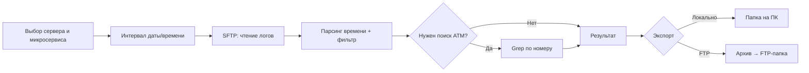

# System Admin Management (SAM)

Приложение на **Python** для централизованного управления микросервисами, развёрнутыми на нескольких серверах. Оператор подключается к удалённым хостам по **SFTP**, работает с логами сервисов, отбирает фрагменты по времени и по идентификаторам (например, номеру банкомата), затем сохраняет результат локально или выгружает архив на **FTP**.

---

## Назначение

| Задача | Описание |
|--------|----------|
| Инфраструктура | **5 серверов**, на каждом — **несколько микросервисов** |
| Доступ | Удалённые файлы (логи, конфиги) через **SFTP** |
| Первый этап | Выгрузка **конкретных логов за выбранный интервал времени** |
| Поиск | Фильтрация по значениям (например, **номер АТМ**) — аналог `grep` по собранным строкам |
| Экспорт | Сохранение в **локальную папку** или **архив + выгрузка по FTP** в одну из заранее заданных удалённых папок |

---

## Целевая модель данных

```
Сервер (1..5)
 └── Микросервис (N)
      └── Логи (файлы / ротация по дате)
           └── Строки с меткой времени (разные форматы разделителей)
```

Конфигурация (планируется): список серверов, пути к логам каждого сервиса, шаблоны разбора времени, пресеты FTP-папок, учётные данные (вне репозитория).

---

## Функциональные требования (MVP и далее)

### 1. Выборка логов по времени (MVP)

Пользователь задаёт:

- **дату**: год, месяц, день;
- **время**: часы и минуты (начало и, при необходимости, конец интервала).

Система:

1. Подключается к нужному серверу по SFTP.
2. Находит файлы логов за указанную дату (по имени файла и/или по содержимому).
3. Парсит метки времени в строках. В разных сервисах форматы могут отличаться, например:
   - `2026-05-21 14:30:00`
   - `21.05.2026 14:30:00`
   - `2026/05/21T14:30:00`
   - `21-May-2026 14:30`
4. Возвращает только строки, попадающие в заданный интервал.

Для каждого микросервиса в конфиге задаётся **шаблон (regex) или набор шаблонов** разбора времени.

### 2. Поиск по содержимому (АТМ и др.)

После (или вместе с) отбором по времени:

- ввод **номера банкомата** (или другого идентификатора);
- поиск по уже отфильтрованным строкам (режим «как grep»);
- объединение результатов с нескольких серверов/сервисов в один набор.

### 3. Действия с результатом

Когда логи собраны, пользователь выбирает:

| Действие | Поведение |
|----------|-----------|
| **Сохранить локально** | Копирование в выбранную папку на машине оператора (структура: сервер / сервис / дата и т.п.) |
| **Архив + FTP** | Упаковка в архив (`zip` / `tar.gz`), загрузка на FTP-хост в одну из **нескольких преднастроенных папок** |

---

## Предполагаемый сценарий работы



---

## Архитектура (черновик)

Рекомендуется разделение на модули:

| Модуль | Ответственность |
|--------|-----------------|
| `config` | Серверы, сервисы, пути логов, regex времени, FTP-пресеты |
| `sftp_client` | Подключение, листинг, потоковое чтение больших файлов |
| `log_parser` | Нормализация времени, фильтр по интервалу |
| `grep_filter` | Поиск по паттерну / номеру АТМ |
| `export` | Локальное сохранение, архивация |
| `ftp_client` | Загрузка архива в выбранную удалённую папку |
| `cli` или `ui` | Интерфейс оператора (см. этап 2) |

На первом этапе достаточно **CLI**; веб-интерфейс — опционально позже.

---

## Конфигурация (пример структуры)

```yaml
servers:
  - id: srv-01
    host: 10.0.0.1
    port: 22
    services:
      - name: payment-api
        log_dir: /var/log/payment-api
        time_patterns:
          - '%Y-%m-%d %H:%M:%S'
          - '%d.%m.%Y %H:%M:%S'

ftp_targets:
  - id: logs-archive-main
    host: ftp.example.com
    remote_dirs:
      - /incoming/logs/atm
      - /incoming/logs/payment
      - /incoming/logs/misc
```

Секреты (пароли, ключи) — через переменные окружения или отдельный файл `.env`, **не** в git.

---

## Этапы разработки

1. **MVP**: SFTP + выборка по дате/времени + сохранение в локальную папку.
2. **Поиск**: фильтр по номеру АТМ (и расширяемые поля).
3. **Экспорт**: архивирование и загрузка на FTP в выбранную папку.
4. **Удобство**: CLI с подсказками, кэш списка файлов, параллельная выгрузка с нескольких серверов.
5. **Опционально**: веб-UI, история операций, уведомления об ошибках.

---

## Стек: возможные библиотеки

Ниже — кандидаты на выбор по мере реализации. Для MVP достаточно отметить **рекомендуемые**; остальное — альтернативы.

### SSH / SFTP (обязательно для доступа к логам)

| Библиотека | Назначение | Примечание |
|------------|------------|------------|
| **[Paramiko](https://www.paramiko.org/)** | SSH/SFTP клиент | **Рекомендуется** — зрелая, широко используется |
| [asyncssh](https://asyncssh.readthedocs.io/) | Асинхронный SSH/SFTP | Если нужна параллельная выгрузка с 5 серверов |
| [Fabric](https://www.fabfile.org/) | SSH + выполнение команд | Удобно, если позже понадобится `grep` на удалённой машине |

### FTP (выгрузка архивов)

| Библиотека | Назначение | Примечание |
|------------|------------|------------|
| **`ftplib`** (stdlib) | FTP клиент | **Рекомендуется** для простых сценариев |
| [ftputil](https://ftputil.sschwarzer.net/) | Высокоуровневый FTP | Удобнее работа с путями и деревом каталогов |
| [aioftp](https://aioftp.readthedocs.io/) | Асинхронный FTP | При больших объёмах и неблокирующем I/O |

> Если на целевой стороне будет **SFTP вместо FTP** для выгрузки — можно использовать тот же Paramiko, без отдельного FTP-стека.

### CLI и UX в терминале

| Библиотека | Назначение | Примечание |
|------------|------------|------------|
| **[Typer](https://typer.tiangolo.com/)** | CLI с типами и подкомандами | **Рекомендуется** |
| [Click](https://click.palletsprojects.com/) | Альтернатива Typer | Классический выбор |
| [Rich](https://rich.readthedocs.io/) | Таблицы, прогресс, цветной вывод | Для длинных выгрузок логов |
| [Textual](https://textual.textualize.io/) | TUI (интерактивный терминал) | Если нужен «псевдо-GUI» в консоли |
| [questionary](https://questionary.readthedocs.io/) | Интерактивные меню | Выбор сервера / FTP-папки стрелками |

### Конфигурация и валидация

| Библиотека | Назначение | Примечание |
|------------|------------|------------|
| **[Pydantic](https://docs.pydantic.dev/)** + **[pydantic-settings](https://docs.pydantic.dev/latest/concepts/pydantic_settings/)** | Модели серверов, сервисов, FTP | **Рекомендуется** |
| [PyYAML](https://pyyaml.org/) | YAML-конфиг | Читаемые конфиги для админов |
| [python-dotenv](https://github.com/theskumar/python-dotenv) | Секреты из `.env` | Пароли SFTP/FTP |

### Дата, время и разбор логов

| Библиотека | Назначение | Примечание |
|------------|------------|------------|
| **`datetime`** + **`re`** (stdlib) | Парсинг и фильтр | База для MVP |
| [python-dateutil](https://dateutil.readthedocs.io/) | Гибкий разбор дат | Разные разделители в логах |
| [dateparser](https://dateparser.readthedocs.io/) | «Угадывание» формата даты в строке | Если форматов очень много |
| [pendulum](https://pendulum.eustace.io/) | Интервалы, таймзоны | Если серверы в разных TZ |

### Поиск по логам (grep / АТМ)

| Библиотека | Назначение | Примечание |
|------------|------------|------------|
| **`re`** (stdlib) | Regex по номеру АТМ | **Рекомендуется** |
| [ripgrep](https://github.com/BurntSushi/ripgrep) (внешний бинарник) | Быстрый поиск по большим файлам | Через `subprocess`, если логи сначала скачаны локально |
| [hyperscan](https://github.com/darvid/python-hyperscan) | Очень быстрый multi-pattern search | Сложнее в установке; для огромных объёмов |

### Архивация

| Библиотека | Назначение | Примечание |
|------------|------------|------------|
| **`zipfile`** / **`tarfile`** (stdlib) | ZIP / tar.gz | **Рекомендуется** |
| [py7zr](https://py7zr.readthedocs.io/) | 7z | Если на FTP требуют именно `.7z` |

### Асинхронность и I/O

| Библиотека | Назначение | Примечание |
|------------|------------|------------|
| **`asyncio`** (stdlib) | Параллельные SFTP-сессии | С `asyncssh` |
| [aiofiles](https://github.com/Tinche/aiofiles) | Асинхронная запись локальных файлов | При массовом экспорте |

### Логирование самого приложения SAM

| Библиотека | Назначение | Примечание |
|------------|------------|------------|
| **`logging`** (stdlib) | Логи SAM | Достаточно для старта |
| [structlog](https://www.structlog.org/) | Структурированные логи | Удобно для отладки SFTP/FTP |
| [loguru](https://github.com/Delgan/loguru) | Простой API | Альтернатива structlog |

### Тестирование и качество

| Библиотека | Назначение | Примечание |
|------------|------------|------------|
| [pytest](https://docs.pytest.org/) | Юнит- и интеграционные тесты | **Рекомендуется** |
| [pytest-mock](https://pytest-mock.readthedocs.io/) | Моки SFTP/FTP | Без реальных серверов в CI |
| [ruff](https://docs.astral.sh/ruff/) | Линтер + форматтер | Быстрая замена flake8/black |
| [mypy](https://mypy-lang.org/) | Проверка типов | В связке с Pydantic |

### Веб-интерфейс (опционально, не MVP)

| Библиотека | Назначение | Примечание |
|------------|------------|------------|
| [FastAPI](https://fastapi.tiangolo.com/) | API + фоновые задачи выгрузки | Если нужен браузерный UI |
| [Streamlit](https://streamlit.io/) | Быстрый прототип UI | Для внутреннего админ-инструмента |

### Минимальный набор для старта (рекомендация)

```
paramiko          # SFTP
typer + rich      # CLI
pydantic          # конфиг
pyyaml            # config.yaml
python-dateutil   # разные форматы времени в логах
python-dotenv     # секреты
# ftplib, zipfile, tarfile, re, datetime — из stdlib
pytest            # тесты
```

Файл зависимостей (`requirements.txt` или `pyproject.toml`) будет добавлен на этапе инициализации кода.

---

## Ограничения и риски

- **Большие лог-файлы**: читать потоково, не загружать целиком в память.
- **Разные форматы времени**: без конфига regex по сервису фильтр будет ненадёжным.
- **Часовые пояса**: явно зафиксировать TZ сервера и оператора в конфиге.
- **Безопасность**: ключи SSH предпочтительнее паролей; FTP — только в доверенной сети или FTPS/SFTP.
- **Права на удалённых путях**: учётная запись SFTP должна иметь read на каталоги логов.

---

## Статус проекта

| Компонент | Статус |
|-----------|--------|
| README / описание | В работе |
| Код приложения | Не начат |
| Конфиг серверов и сервисов | Планируется |
| MVP: выгрузка по времени | Планируется |

---

## Лицензия и контрибуция

Уточняется владельцем репозитория. После появления кода — `CONTRIBUTING.md` и шаблон конфига `config.example.yaml`.
